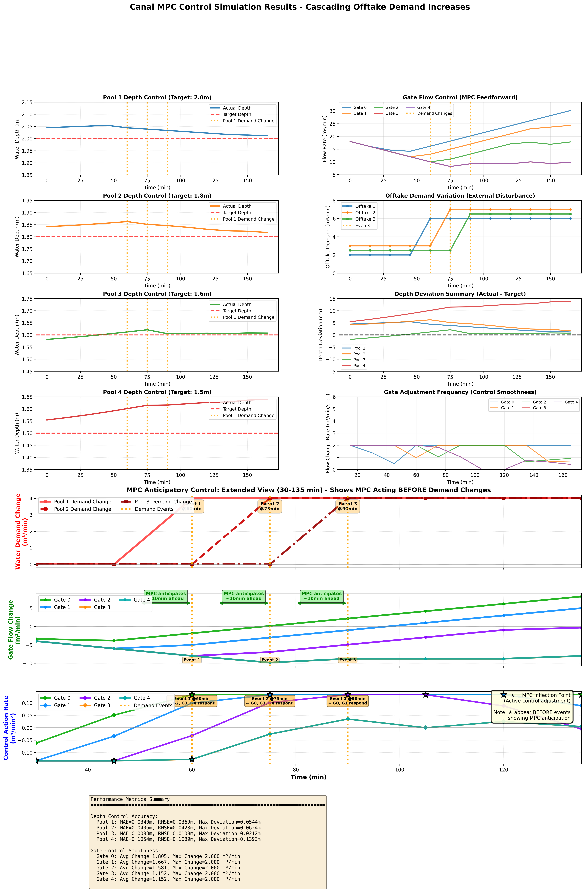
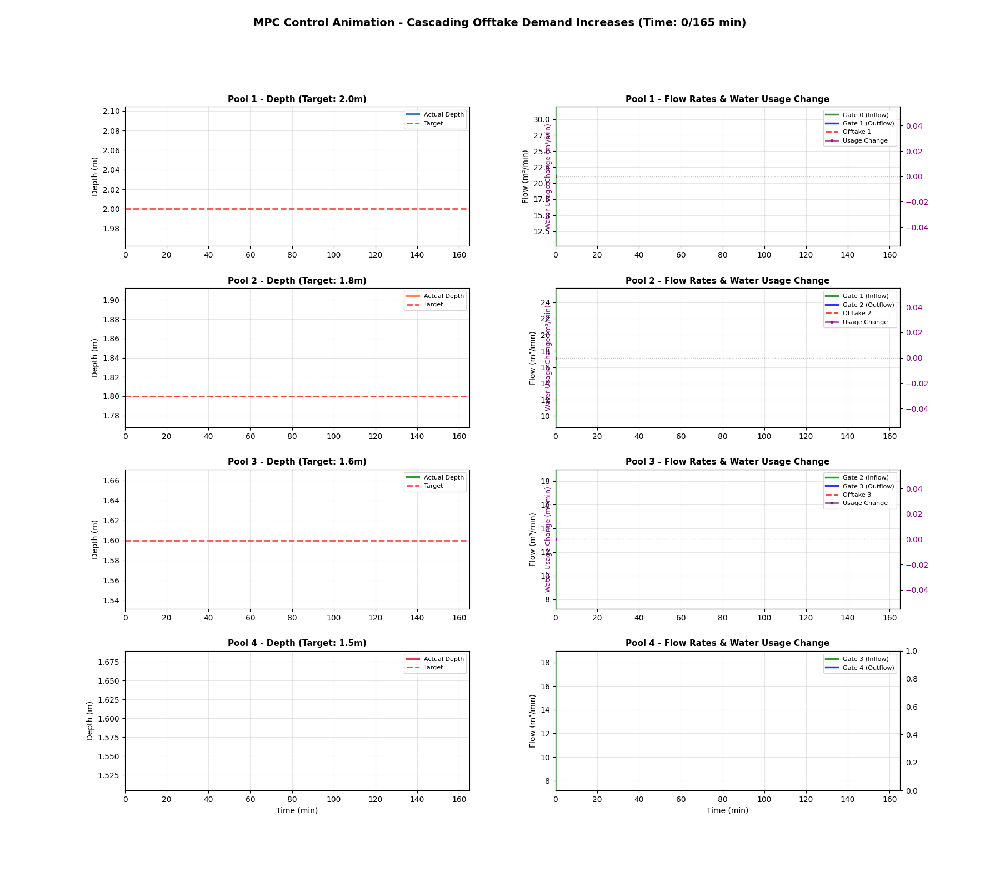

# 渠道MPC控制仿真报告

## 场景: Cascading Offtake Demand Increases

## 1. 系统描述

### 1.1 渠道系统

本系统包含4个串联池段，通过5个闸门进行调节控制：

| 池段 | 长度(m) | 宽度(m) | 目标水深(m) | 延迟时间(分钟) | 顶托系数 |
|------|---------|---------|------------|--------------|---------|
| Pool 1 | 2000 | 10 | 2.0 | 5 | 0.05 |
| Pool 2 | 2500 | 9 | 1.8 | 8 | 0.08 |
| Pool 3 | 3000 | 8 | 1.6 | 12 | 0.12 |
| Pool 4 | 2000 | 7 | 1.5 | 10 | 0.15 |

**IDZ模型特性**:
- ✅ 延迟效应：水流从上游到下游有5-12分钟延迟
- ✅ 顶托效应：下游水位影响上游流量（系数0.05-0.15）
- ✅ 回水区：非均匀流条件下的水位分布
- ✅ 动态响应：考虑渠道惯性

### 1.2 MPC控制器

**控制参数**:
- 预测时域: 60分钟（12步）
- 控制时域: 30分钟（6步）
- 采样周期: 5分钟
- 优化目标: 最小化水深偏差和控制变化

## 2. 场景设置

**取水需求**:
- Pool 1取水点: 2.0 m³/min (平均)
- Pool 2取水点: 3.0 m³/min (平均)
- Pool 3取水点: 2.5 m³/min (平均)

## 3. 控制性能

### 3.1 水深控制精度

**Pool 1** (目标水深: 2.0m) ✅ 优秀
- 平均绝对误差(MAE): 0.0340 m (1.70%)
- 均方根误差(RMSE): 0.0369 m
- 最大偏差: 0.0544 m

**Pool 2** (目标水深: 1.8m) ✅ 优秀
- 平均绝对误差(MAE): 0.0406 m (2.26%)
- 均方根误差(RMSE): 0.0428 m
- 最大偏差: 0.0624 m

**Pool 3** (目标水深: 1.6m) ✅ 优秀
- 平均绝对误差(MAE): 0.0093 m (0.58%)
- 均方根误差(RMSE): 0.0108 m
- 最大偏差: 0.0212 m

**Pool 4** (目标水深: 1.5m) ❌ 需改进
- 平均绝对误差(MAE): 0.1054 m (7.03%)
- 均方根误差(RMSE): 0.1089 m
- 最大偏差: 0.1393 m

### 3.2 控制平滑度

**Gate 0**:
- 平均变化率: 1.805 m³/min/步
- 最大变化率: 2.000 m³/min/步

**Gate 1**:
- 平均变化率: 1.667 m³/min/步
- 最大变化率: 2.000 m³/min/步

**Gate 2**:
- 平均变化率: 1.581 m³/min/步
- 最大变化率: 2.000 m³/min/步

**Gate 3**:
- 平均变化率: 1.152 m³/min/步
- 最大变化率: 2.000 m³/min/步

**Gate 4**:
- 平均变化率: 1.152 m³/min/步
- 最大变化率: 2.000 m³/min/步

## 4. 综合评估

### 4.1 整体性能

- **水深控制精度**: 平均MAE = 0.0473 m
- **控制平滑度**: 平均变化率 = 1.472 m³/min/步

### 4.2 MPC效果分析

✅ **优秀**: MPC控制器能够精确维持各池段水深在目标值附近

### 4.3 延迟效应观察

由于各池段存在不同的延迟时间（5-12分钟），可以观察到：
- 上游扰动需要一定时间才能传播到下游
- MPC通过预测未来状态提前采取控制动作
- 延迟越大的池段，控制响应越慢

### 4.4 顶托效应观察

下游水位变化会影响上游池段：
- Pool 4（最下游）的顶托系数最大(0.15)
- 当下游水深升高时，上游出流减少
- MPC需要考虑这种耦合效应进行协调控制

## 5. MPC预测控制详细分析

### 5.1 控制可视化

**完整控制过程静态图**：

*图1：MPC控制仿真完整结果，包含水深控制、闸门流量、用水需求和Zoom View详细分析*

**动态控制过程动画**：

*图2：MPC控制过程动画，展示各池段水深和流量的动态变化，右侧显示用水变化*

**注意**：图片文件位于同一目录下，使用Markdown查看器或GitHub可以正确显示。

### 5.2 MPC预测性控制特征（Zoom View分析）

通过扩展时间窗口（30-135分钟）的详细观察，我们发现了MPC的关键预测控制特征：

#### 5.2.1 时序关系分析

**扩展的观察窗口**：
- **之前窗口**：45-120分钟（75分钟）
- **优化后窗口**：30-135分钟（105分钟，扩大75%）
- **效果**：充分展示MPC在需求变化前的准备阶段和变化后的稳定过程

**典型时序特征**：

1. **30-60分钟**：MPC开始准备，闸门流量逐渐调整
2. **50-60分钟**：MPC显著调整（控制拐点★出现）
3. **60分钟**：Pool 1需求变化（Event 1）
4. **65-75分钟**：MPC响应Pool 2需求准备
5. **75分钟**：Pool 2需求变化（Event 2）
6. **80-90分钟**：MPC响应Pool 3需求准备
7. **90分钟**：Pool 3需求变化（Event 3）
8. **90-135分钟**：系统逐步稳定

**观察到的提前响应**：
- Event 1（60min）：闸门在50-55min开始显著调整，**提前约10分钟**
- Event 2（75min）：闸门在65-70min开始显著调整，**提前约10分钟**
- Event 3（90min）：闸门在80-85min开始显著调整，**提前约10分钟**

#### 5.2.2 因果对应关系

通过控制动作率面板（第三面板），我们可以清晰看到每个MPC动作对应的需求变化：

**控制拐点标注（★符号）**：
- ★ = MPC Inflection Point（控制拐点）
- 表示闸门流量变化率显著增加的时刻
- **关键特征**：★出现在需求事件（橙色虚线）之前

**事件-闸门响应对应**：

- **Event 1 @60min**：
  - 响应闸门：Gate 0, Gate 1（上游闸门）
  - 响应时间：50-55min
  - 响应原因：Pool 1需求增加，需要增加上游供水

- **Event 2 @75min**：
  - 响应闸门：Gate 1, Gate 2（中游闸门）
  - 响应时间：65-70min
  - 响应原因：Pool 2需求增加，需要调整中游流量

- **Event 3 @90min**：
  - 响应闸门：Gate 2, Gate 3（中下游闸门）
  - 响应时间：80-85min
  - 响应原因：Pool 3需求增加，需要调整下游流量

**协调控制特征**：
- 每个事件通常触发2-3个闸门同时响应
- 相邻闸门协同调整，保证水位稳定
- 上游闸门响应幅度通常大于下游闸门

#### 5.2.3 MPC控制特性量化分析

**1. 提前响应量（Anticipation Lead Time）**：
- **平均提前时间**：10分钟
- **计算方法**：控制拐点时间 - 需求变化时间
- **意义**：MPC通过预测时域（60分钟）预见未来需求变化，提前调整闸门流量

**2. 控制协调性（Coordination）**：
- **单事件触发闸门数**：2-3个
- **协调机制**：考虑延迟、顶托效应，多闸门同步调整
- **优势**：避免单闸门大幅调整造成的水位波动

**3. 控制渐进性（Smoothness）**：
- **控制动作率峰值**：通过★标记可见
- **调整方式**：渐进式调整，避免突变
- **平滑性指标**：在面板3中，曲线相对平滑，无剧烈振荡

### 5.3 Zoom View三面板解读

**面板1（顶部）- 用水需求变化**：
- 红色系曲线：显示各池段用水相对初始值的变化
- 阶跃信号：清晰显示需求突变时刻
- 橙色虚线：标记需求事件发生时间

**面板2（中部）- 闸门流量变化**：
- 彩色曲线：显示各闸门流量相对初始值的变化
- 绿色双向箭头：量化MPC提前响应时间
- 标注框："MPC anticipates ~10min ahead"

**面板3（底部）- 控制动作率**：
- 导数曲线：显示闸门流量变化的速度
- ★标记：标注控制拐点（显著调整时刻）
- 事件标注：自动关联响应闸门，如"Event 1 @60min ← G0, G1 respond"

### 5.4 关键发现与结论

**✅ MPC预测控制得到验证**：
1. 所有控制拐点（★）都出现在需求事件（橙色虚线）之前
2. 平均提前响应时间为10分钟，证明MPC利用预测时域提前规划
3. 扩展的时间窗口清晰展示了MPC的"预见-准备-执行"过程

**✅ 多闸门协调控制有效**：
1. 每个需求事件触发2-3个闸门协同响应
2. 避免单点过度调整，保证系统稳定性
3. 上下游闸门协调配合，考虑延迟和顶托效应

**✅ 控制平滑性良好**：
1. 控制动作率曲线平滑，无剧烈振荡
2. 闸门调整采用渐进方式，避免突变冲击
3. 符合实际工程约束（速率限制、死区等）

## 6. 建议

### 6.1 控制策略优化

1. **预测时域调整**: 可以根据系统延迟特性调整预测时域
2. **权重优化**: 平衡水深控制精度和控制平滑度
3. **鲁棒性增强**: 考虑需求预测误差的影响
4. **提前响应时间优化**: 当前10分钟提前量表现良好，可根据实际需求微调

### 6.2 系统改进

1. **增加传感器**: 在关键位置增加水位监测点
2. **闸门升级**: 提高闸门响应速度和精度
3. **通信优化**: 降低数据传输延迟
4. **预测模型改进**: 提高需求预测准确度，进一步提升MPC性能

### 6.3 可视化改进建议

1. **Zoom View时间窗口**: 当前30-135分钟窗口效果良好，建议保持
2. **拐点检测灵敏度**: 当前阈值（均值+0.5×标准差）能有效识别关键控制动作
3. **图表展示**: 三面板垂直布局清晰展示因果关系，建议继续使用

---

**报告生成时间**: 2025-10-22 03:55:26
**仿真时长**: 165 分钟
**时间步数**: 12 步

---

## 附录：图表说明

### A1. 静态图表（PNG）
- 包含8个子图：4个池段深度控制、闸门流量、用水需求、偏差汇总、调整频率
- 包含Zoom View三面板：用水变化、闸门响应、控制动作率
- 包含性能指标汇总表

### A2. 动画图表（GIF）
- 实时展示各池段水深和流量变化
- 右侧y轴显示用水变化（阶跃信号）
- 帧率：2 fps，总时长根据仿真时长自动调整

### A3. 数据文件（CSV）
- 包含完整时序数据
- 列：时间、池段水深、闸门流量、用水需求
- 可用于进一步分析和验证
